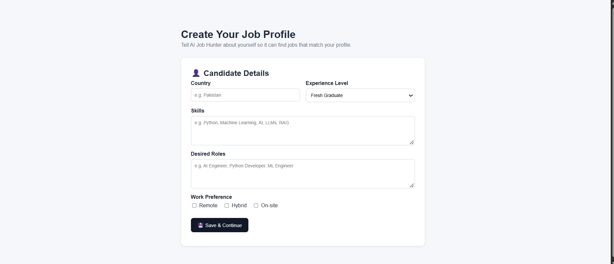
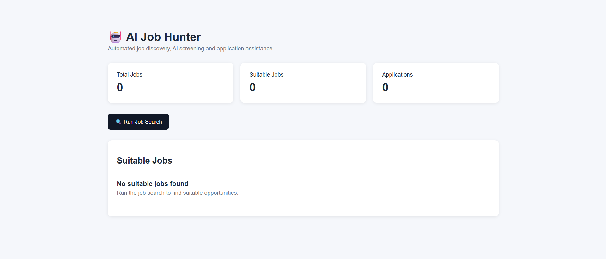
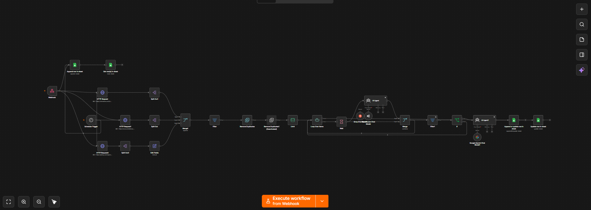

# AI Job Hunter

An AI-powered job search and screening automation built with n8n, Google Sheets, and LLM-based job evaluation.

## Project Screenshots

### Create Your Job Profile

### Job Search Dashboard

### n8n Automation Workflow

## Features

- Multi-source job collection
- Profile-based job screening
- AI-powered suitability evaluation
- Entry-level and fresher-focused filtering
- Duplicate job prevention
- AI-generated application packages
- Google Sheets job storage
- Search execution status tracking
- Error handling
- Web-based candidate profile creation
- Web-based job search dashboard
- Scheduled automatic job searches
- Profile-specific job results

## Technology Stack

- n8n
- Google Sheets
- REST APIs
- JavaScript
- HTML
- CSS
- Large Language Models
- Webhooks
- Workflow Automation

## Job Sources

- Remotive
- Arbeitnow
- Jobicy

## Project Structure

AI-Job-Hunter/
+-- .gitignore
+-- README.md
+-- n8n/
    +-- job-discovery-workflow.json
    +-- save-profile-workflow.json
    +-- search-status-workflow.json
    +-- error-handler-workflow.json
    +-- web-interface-workflow.json

## Workflow

1. Candidate creates a profile.
2. Profile information is stored in Google Sheets.
3. A job search is started.
4. Jobs are collected from multiple sources.
5. Jobs are filtered for relevance.
6. Duplicate listings are removed.
7. Jobs are processed individually.
8. AI evaluates each job against the candidate profile.
9. Unsuitable jobs are discarded.
10. Suitable jobs receive an application package.
11. Suitable jobs are stored in Google Sheets.
12. The dashboard displays the results.

## Author

Azeem Ur Rehman

Software Engineering Graduate | AI/ML | LLM Applications | RAG | AI Automation | n8n

